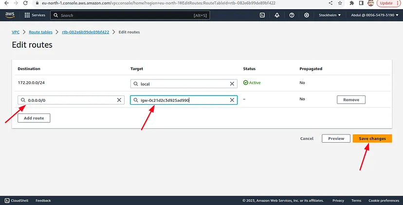
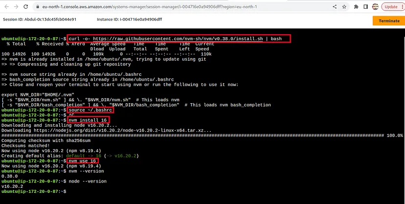
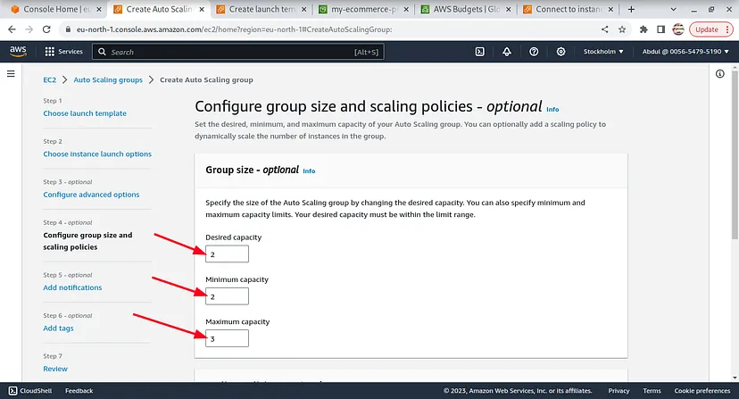
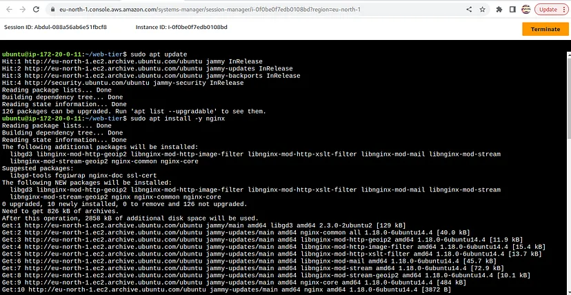
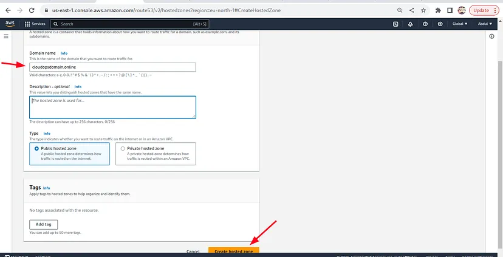
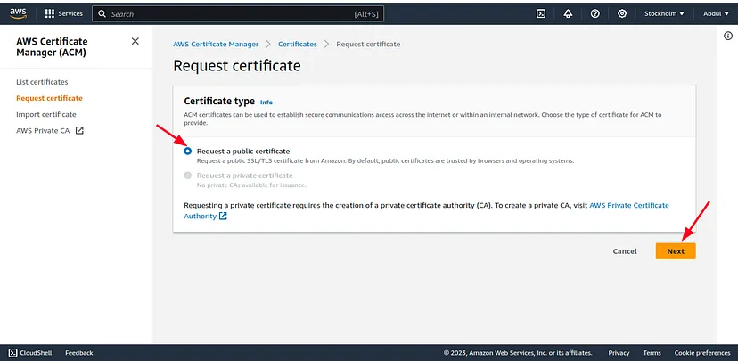

# Three (3) Tier Architecture to Host a MERN stack Application on AWS
Lateef Taiwo AWS in Plain English Lateef Taiwo

For the doc [Click here](https://aws.plainenglish.io/three-3-tier-architecture-to-host-a-mern-stack-application-on-aws-fc95a97b2bea)
### The Magical Cloud Web Kingdom: An AWS Adventure Story

A long time ago, in the realm of digital enchantment, there existed a wondrous web kingdom adorned with awe-inspiring websites. Within this realm, a particular web application held a special place in the hearts of many. However, as the number of visitors swelled, the website transformed into a bustling marketplace.

The sagacious web developers of this kingdom discerned the need to fortify and expedite the website’s performance to accommodate its burgeoning popularity. Their solution was to transport the website to a cloud realm known as AWS, a realm replete with formidable tools to aid them in their quest.

Firstly, they erected a secure and clandestine enclave for the website, a Virtual Private Cloud (VPC), akin to a castle with discrete chambers. Some chambers were open to the public, akin to the exquisite website pages, while others remained concealed, safeguarding confidential data.

Subsequently, they fashioned a special repository, a database, wherein all vital information, such as visitor names and messages, found sanctuary. This treasure chest was concealed within the innermost sanctum of the VPC, accessible only to the website.

To ensure the website’s resilience and agility, they conjured numerous duplicates using a mystical mirror known as an Amazon Machine Image (AMI). Each duplicate bore an identical visage and could come to the website’s aid during peak times, akin to having a multitude of companions at play.

To receive visitors from far-flung realms, they constructed a grand entrance way, a load balancer, akin to a cordial guide extending a warm welcome to all, channeling them toward different replicas of the website, sparing none the wait.

The web developers also enlisted the services of a sagacious wizard known as Auto Scaling. When the hordes of visitors swelled, this wizard created additional duplicates of the website to lend assistance. When tranquility descended, the wizard bid farewell to the surplus duplicates with a wave of its magical wand.

To ensure the kingdom’s security, they erected formidable ramparts known as security groups. These ramparts permitted only virtuous visitors to traverse, repelling any malevolent intruders, much like gallant knights safeguarding the realm.

Lastly, they enhanced the website’s security with a unique ward from a sagacious sorcerer known as AWS Certificate Manager. This ward was akin to a magical shield, enveloping the website and safeguarding all its secrets.

Empowered by these mystical tools from AWS, the web application became even more secured, powerful and faster. All inhabitants of the kingdom were delighted in visiting the website, relishing its charms. And they all dwelt contentedly ever after in the cloud kingdom of AWS! The end.

### Overview of Architecture


## Part 0: Getting Started

Story: Once upon a time, within the enchanting realm of web development, a group of young and ambitious developers harbored dreams of crafting their very own Three-Tier Web Application. Their vision was to fashion a captivating website that would stand as a central hub for sharing tales, images, and adventures from across the mystical kingdom. Little did they fathom that this endeavor would lead them into the extraordinary domain of Amazon Web Services (AWS).

Welcome to the first part of our nine-part blog on deploying a three-tier-web architecture on AWS! In this initial segment, we’ll cover the essential setup required to kickstart your AWS journey. So, let’s dive right in!

### Step 1: Downloading the Code from GitHub

To begin, you’ll need to obtain the necessary code for our project. Head over to our GitHub repository and download the code.
```github
git clone https://github.com/aws-samples/aws-three-tier-web-architecture-workshop.git

```
If you don’t have git installed, follow this [link](https://git-scm.com/book/en/v2/Getting-Started-Installing-Git) to install git on your preferred operating system.

### Step 2: Creating an S3 Bucket

Moving forward, our next task is to create an Amazon S3 bucket that will serve as the storage for our code. To create the bucket, kindly proceed with the following steps.

i) Open the AWS console and navigate to the S3 service and click on the “Create Bucket” button.


ii) Give the bucket a unique name, leave all the defaults settings and click create bucket


Step 3: Creating an IAM EC2 Instance Role Now, we’ll create an IAM role for our EC2 instances, which will grant them the necessary permissions to interact with AWS services. Here’s how you can do it:

i) Go to the IAM dashboard in the AWS console. Select “Roles” and click on “Create Role.”

ii) Choose “EC2” as the trusted entity for this role.

iii) In the permissions section, include the following AWS managed policies by searching for them and selecting them:

* AmazonSSMManagedInstanceCore
* AmazonS3ReadOnlyAccess


These policies will enable our instances to download code from S3 and securely connect through AWS System Manager Session Manager without SSH keys.

iv) Give your role a descriptive name and click “Create Role” to complete the process.

Congratulations! You’ve completed the initial setup.

## Part 1: Building a Secure VPC Infrastructure

__Story__: Our brave developers started their adventure by building the base for their web kingdom. They created a Virtual Private Cloud (VPC) on AWS, which was like a secure space for their web application. Inside this VPC, they made two public subnets for the front-end, two private subnets for the application, and two private subnets for the database. These subnets were in different parts of the kingdom.

In this part, we’ll build the base by creating a Virtual Private Cloud (VPC) and setting up important network stuff. We’ll also make security groups to protect our EC2 instances, Aurora database, and Elastic Load Balancers.

Step 1: Creating a VPC and Subnets

To begin building our isolated network environment, we’ll start by creating a Virtual Private Cloud (VPC) and the necessary subnets.

### i) Setup VPC

A VPC provides a private virtual network within the AWS cloud. Follow these steps to create one:

a. On the AWS console, navigate to the VPC dashboard. Click on “Your VPCs” on the left-hand side. Click the “Create VPC” button.


b. Give your VPC a descriptive Name tag and choose an appropriate CIDR (Classless Inter-Domain Routing) range. Ensure that the CIDR range allows for the creation of at least six subnets, as we’ll need them for our project. I used a CIDR range of 172.20.0.0/24.

### ii) Create Subnets

Subnets are like sections in the VPC’s address range. We’ll make six subnets in two availability zones to create a highly available and fault-tolerant infrastructure.

a. In the AWS console, navigate to “Subnets” on the left-hand side of the dashboard and click “Create Subnet.”


b. We’ll split the subnets equally between two availability zones. Each availability zone will get three subnets for our application’s three layers. For every subnet, pick the VPC we made before, give it a name, choose an availability zone, and set the right CIDR range.

Remember: It’s a good idea to use names that show what each subnet is for and which availability zone it’s in. For instance, you can use names like “Public-Web-Subnet-AZ1,” “Private-App-Subnet-AZ1,” and “Private-DB-Subnet-AZ1.”


c. If all 6 subnets are created successfully, you will see a message “You have successfully created 6 subnets:”


d. Your final subnet setup should be similar to this. Verify that you have 3 subnets across 2 different availability zones.


### Step 2: Internet Connectivity

Now that our VPC and subnets are set up, we need to configure internet connectivity for our public subnets.

i) Internet Gateway (IGW)

The Internet Gateway enables communication between instances in the VPC and the internet.

a. In the VPC dashboard, select “Internet Gateways” on the left-hand side. Click on “Create internet gateway”.


b. Give it a descriptive name, and click “Create internet gateway.”


c. After creating the gateway, attach it to the VPC you created earlier. This allows instances within the VPC to access the internet and respond to requests from the internet.


ii) NAT Gateway

To enable instances in our private application layer subnets to access the internet for necessary updates or external services, we’ll set up a Network Address Translation (NAT) gateway.

a. In the VPC dashboard, select “NAT Gateways” on the left-hand side and click “Create NAT Gateway.”


b. Give the NAT gateway a name, choose one of the public subnets created earlier, and allocate an Elastic IP to it. Click “Create NAT Gateway.”


c. Repeat the previous step for the other public subnet to create a second NAT gateway and for high availability, ensure it’s in a different availability zone from the first NAT gateway.


### iii) Routing Configuration

Now that we have both internet and NAT gateways, we need to configure routing to direct traffic accordingly.

a. Create a route table for the public subnets responsible for the web layer. Give it a descriptive name, select the custom VPC we created and click create route table.


b. Click on the “Routes” tab in the route table’s details page, and then click “Edit routes.”


c. Add a route that directs all traffic (0.0.0.0/0) from the VPC to the internet gateway as the target. This ensures that any requests from the public subnets to IPs outside the VPC CIDR range are routed to the internet gateway for external access.


d. Edit the Explicit Subnet Associations of the route table to include the two public subnets created earlier, and click “Save associations.”


e. Create two additional route tables, one for each app layer private subnet in each availability zone. These route tables will route app layer traffic destined for IPs outside the VPC to the respective NAT gateway for internet access.


### Configure these route tables as follows:

For the first app layer private subnet (Availability Zone 1):

Add a route to direct all traffic (0.0.0.0/0) to the NAT gateway in the same availability zone and add the appropriate subnet association.


For the second app layer private subnet (Availability Zone 2):

Add a route to direct all traffic (0.0.0.0/0) to the NAT gateway in the other availability zone and add the appropriate subnet association.


### iv) Configuring Security Groups

Security groups act as virtual firewalls, controlling inbound and outbound traffic to our resources.

a. In the VPC dashboard, select “Security Groups” under “Security” on the left-hand side.

b. Create the first security group for the public-facing load balancer. Give it a descriptive name and add an inbound rule to allow HTTP traffic (port 80) from your IP address. This ensures you can access the load balancer during testing.


c. Create a second security group for the public instances in the web tier. Provide a descriptive name, and add an inbound rule to allow HTTP traffic from the previously created internet-facing load balancer security group. This allows traffic from the public-facing load balancer to reach the web instances. Additionally, add another inbound rule to allow HTTP traffic from your IP address for testing purposes.


d. Create the third security group for the internal load balancer. Name it accordingly and add an inbound rule to allow HTTP traffic from the public instance security group. This allows the internal load balancer to communicate with the web tier instances.


e. Configure the fourth security group for the private instances. Provide a descriptive name and add an inbound rule to allow TCP traffic on port 4000 from the internal load balancer security group. This will enable the internal load balancer to forward traffic to our private instances on port 4000. Additionally, add another inbound rule to allow your IP address for testing.


f. For the fifth security group, protecting our private database instances, give it a meaningful name and add an inbound rule to allow traffic from the private instance security group on the MYSQL/Aurora port (3306). This ensures that the private instances can communicate with the database securely.


Great job! You’ve effectively created the network and security foundation for your AWS setup. In Part 2, we’ll get into launching EC2 instances and configuring a three-tier architecture! Have fun with your networking and security work!

## Part 2: Configure and Deploy the Database

Next, our heroes needed a spot to keep all the important data for their web app. They chose Amazon RDS, a dependable database service. They made a Database Subnet Group and picked the right subnets for their database layer. Then, they created an Amazon Aurora MySQL database, which would hold all the important stuff from the web kingdom.

In this part, we’ll set up our database and make sure the subnet groups are ready so that everything can talk to each other smoothly in the Virtual Private Cloud (VPC).

### Step 1: Subnet Groups

i) Setting up Subnet Groups for Amazon Aurora RDS

Start by creating a Database Subnet Group, which will allow our Amazon Aurora database to utilize the specified subnets within the VPC.

a. Navigate to the RDS dashboard in the AWS console and click on “Subnet Groups” on the left-hand side. Now, click “Create DB Subnet Group.”


b. Enter a name and a brief description for the subnet group. Select the VPC that we created in Part 1 to associate it with the database.


c. Before adding subnets to the group, ensure that you choose the subnets specifically created for the database layer in each availability zone. To find the correct subnet IDs, navigate back to the VPC dashboard. If the subnet group is created successfully, you will see a “successfully created” message.


### Step 2: Database Deployment

i) Database Creation

Now, we’ll deploy our MySQL-Compatible Amazon Aurora database into action. Follow these steps:

a. On the RDS dashboard, find “Databases” on the left, and then select “Create Database.”


b. For this setup, we’ll go with a Standard create option for our MySQL-Compatible Amazon Aurora database. Leave the Engine options as default.


c. In the Templates section, pick “Dev/Test” because we’re not using this database for real work right now. In the “Settings” part, create a username and password that you like. Remember to write them down because we’ll use the password to connect to our database.


d. Next, go to the “Availability and durability” section and choose to make a copy or reader node for Aurora in another zone. This makes sure things keep working even if something goes wrong. In the “Connectivity” section, pick the VPC we made in Part 1 and select the subnet group we made before.


e. For better security, choose “No” for public access, so the database isn’t accessible to the public. Use the security group we made for the database, and be sure to pick password authentication as our way to log in.

Finally, click “Create Database” to initiate the database provisioning process.


ii) Once the database is set up, you will notice that there is a reader and a writer instance in each availability zone’s database subnets. These instances are there to make sure things keep running smoothly and perform well. Make sure to jot down the writer endpoint for your database because we’ll need it later to securely connect to the database.


Congratulations! You’ve successfully deployed your Amazon Aurora database and configured the necessary subnet groups.

Happy database deployment!

## Part 3: Deploying the App Tier Instances

Story: It is time to make the application layer work. Our developers called on EC2 Instances, which are like virtual computer knights, to be the strong warriors for the app part. They used Ubuntu AMI as their armor and put them in the private subnets to keep them safe from any trouble.

In this part, we’ll show you how to set up the app tier instances. Let’s begin!

### Step 1: App Instance Deployment

i) To start launching EC2 Instances, go to the EC2 service dashboard in the AWS console. On the left-hand side, click on “Instances,” and then click “Launch Instances” to get started.


ii) Configuring the EC2 Instance

* Name the instance and choose the “Ubuntu” AMI, which is a compatible version for our application.


* We’ll pick the “t3.micro” instance type, and it won’t cost us anything because it’s in the free tier. Because we’ll connect to the instance using Systems Manager Session Manager, you can go ahead without needing a key pair.

* In the “Network settings,” make sure you pick the right VPC and subnet we created before. Since this is the app layer, choose one of the private subnets we created just for this part. Also, select the security group we made for our private app layer things.

* In the “Advanced details,” choose the IAM role we created for this instance, and then click “Launch instance.”


### Step 2: Connecting to the App Instance

i) Connecting via Systems Manager Session Manager (SSM)

After launching the instance, navigate to your list of running EC2 instances by clicking on “Instances” on the left-hand side of the EC2 dashboard. When the instance state shows “running,” connect to your instance by clicking the checkmark box to the left of the instance and then clicking the “Connect” button on the top right corner of the dashboard.

* Select the “Session Manager” tab and click “Connect.” This will open a new browser tab for you.

Note: If you encounter any connection issues, ensure your instances can route to your NAT gateways, and verify that you granted the necessary permissions on the IAM role for the EC2 instance.


ii) Switching to the Correct User and Testing Internet Connectivity

* When you first connect to your instance via Session Manager, you will be logged in as “ssm-user,” the default user. Switch to “ubuntu” user by executing the following command in the browser terminal:

```bash
sudo su ubuntu
```


To test internet connectivity, verify that you can ping the Google DNS servers by running:

```bash
ping 8.8.8.8
```


You should see a transmission of packets. To stop it, press Ctrl + C. Remember: If you can’t access the internet, check your route tables and subnet associations to make sure traffic goes to your NAT gateway.

### Step 3: Configure the Database

i) Downloading the MYSQL

To initiate your DB connection with your Aurora RDS writer endpoint, start by downloading the MYSQL.

First update packages by running 
“sudo apt-get update -y”

```bash
sudo apt-get update -y
```

Then, type “sudo apt-get install mysql-server”, then type “y” when prompted to continue


ii) Connecting to the Database

Execute the following command in the browser terminal, replacing “RDS-ENDPOINT” and “USER-NAME” with the appropriate values:

```bash
mysql -h RDS-ENDPOINT -u USER-NAME -p
```

You’ll be prompted to enter your password. Once you input the password and hit enter, you should be connected to your database.

Note: If you cannot reach your database, verify your credentials and security groups.

iii) Creating a Database and Data Table

* Create a database called “ecommerce_app” with the following command using the MySQL CLI:

```bash
create database ecommerce_app;
```

* Verify that the database was created successfully:

```bash
show databases;
```


* Switch to the newly created database and create the “transactions” table with the following command:

```bash
use ecommerce_app; create table if not exists transactions(id int not null auto_increment, amount decimal(10,2), description varchar(100), primary key(id));
```

* Verify that the table was created:
```bash
show tables;
```


iv) Inserting Data into the Table Insert data into the table for use/testing later:
```bash
insert into transactions (amount,description) values ('500','chocolates');
```
Verify that your data was added successfully:
```bash
select * from transactions;
```
You can add more data by running this command more than ones for different transactions

```bash
insert into transactions (amount,description) values ('800','groceries');
```
Verify that your data was added successfully:
```bash
select * from transactions;
```


v) Configuring the App Instance

Update the database credentials for the app tier by opening the “DbConfig.js” file located in the “application-code/app-tier/” folder from the GitHub repository in your favorite text editor on your computer. Replace the empty strings for DB_HOST, DB_USER, DB_PWD and DB_DATABASE with the credentials you configured for your database. Use the writer endpoint of your database as the hostname and “webapp” for the database. Save the file.
```bash
cd application-code/app-tier/
vim DbConfig.js
```


Type :wq! to save and exit.

__Note__: While updating credentials in the file is done for the simplicity of the lab, it’s advisable to follow best practices and store credentials securely, such as using AWS Secrets Manager.

* Upload the “app-tier” folder to the S3 bucket that we created in Part 0.


* Go back to your SSM session, and install all the necessary components to run our backend application. Let’s start by installing NVM (node version manager).

```bash
curl -o- https://raw.githubusercontent.com/nvm-sh/nvm/v0.38.0/install.sh | bash 
Source ~/.bashrc
```
* Next, install a compatible version of Node.js and make sure it’s being used:

```bash
nvm install 16 
nvm use 16
```


* Install PM2, a daemon process manager that will keep our node.js app running even after we exit the instance or if it is rebooted:
```bash
npm install -g pm2
```


* To download the code from the S3 bucket onto the instance, navigate to the s3 bucket, click on it and click on the app tier folder, under properties tab, copy the app-tier s3 object url


* You may will need to install aws cli to run aws cli commands. So first, run the following commands to install aws cli on the ubuntu App-Tier instance.

```bash
sudo apt update -y
sudo apt install awscli
```

Now, replace the copied S3 URI with “s3://BUCKET_NAME/app-tier/” in the command below. Run the command below to download the app-tier code from the s3 bucket into a folder named app tier on the App-tier instance.

```bash
cd ~/ 
aws s3 cp s3://BUCKET_NAME/app-tier/ app-tier --recursive
```


* Navigate to the “app-tier” directory, install dependencies, and start the app with PM2:

```bash
cd ~/app-tier 
npm install 
pm2 start index.js
```


To verify that the app is running correctly, run the following command:

```bash
pm2 list
```

If you see a status of “online,” the app is running successfully.


If you see “errored,” you’ll need to troubleshoot. To check the latest errors, use this command:

```bash
pm2 logs
```

__Note__: If you encounter any issues, check your configuration file for typos and ensure you’ve followed all installation commands correctly.

* To ensure the app starts and keeps running after server interruptions or reboot, run the following command and save the current list of node processes:

```bash
pm2 startup 
pm2 save
```


### Step 5: Testing the App Tier

Now it’s time to run a couple of tests to ensure our app is correctly configured and can retrieve data from the database.

* To hit our health check endpoint, copy this command into your SSM terminal. This is a simple health check endpoint that confirms whether the app is running:

```bash
curl http://localhost:4000/health
```

The response should be: “This is the health check.”

* Next, test your database connection by hitting the following endpoint locally:

```bash
curl http://localhost:4000/transaction
```

You should receive a response containing the test data we added earlier.


If you can see both of these responses, that’s great news! It means your networking, security, database, and app configurations are all correct.

Awesome job! Your app layer is now completely set up and ready to use. In the next part of our blog, we will explain how to set up the front-end and connect it to the app layer.

Enjoy deploying your app!

## Part 4: Set Up Internal Load Balancing and Auto Scaling

Story: Our heroes knew they needed their app tier to be strong and able to handle more users, so they set up an Internal Load Balancer using the Elastic Load Balancing service. This helpful load balancer shared the incoming traffic between the private app tier instances, making sure everyone had a good experience. They also used Auto Scaling, a powerful tool that made the app tier grow and shrink as needed, adapting to the demands of the web kingdom.

In this section, we will explain how to configure internal load balancing and auto scaling for our app tier instances to ensure they are always available and traffic is managed efficiently.

### Step 1: Creating an App Tier AMI

i) First, navigate to the “Instances” section on the left-hand side of the EC2 dashboard. Select the app tier instance we created earlier, and under “Actions,” choose “Image and templates.” Click “Create Image.”


ii) Name the image and describe it briefly. Then, click “Create image.” It might take a few minutes. If you want to check the image creation status, click “AMIs” under “Images” in the EC2 dashboard’s left-hand navigation panel.

### Step 2: Configuring the Target Group

While the AMI is being created, we can proceed to create our target group, which will be used with the load balancer to balance traffic across our private app tier instances.

i) On the EC2 dashboard, navigate to “Target Groups” under “Load Balancing” on the left-hand side. Click “Create Target Group.”


ii) Choose “Instances” as the target type and name the group something meaningful. Set the protocol to HTTP and the port to 4000 because that’s the port on which our Node.js app runs.


iii) Choose the VPC we’ve been using, and set the health check path to “/health,” which is the health check endpoint of our app. Click “Next.”


iv) For now, don’t register any targets. Just go ahead and create the target group.


## Step 3: Configuring the Internal Load Balancer

i) On the left-hand side of the EC2 dashboard, select “Load Balancers” under “Load Balancing” and click “Create Load Balancer.”

ii) We’ll be using an Application Load Balancer (ALB) for our HTTP traffic, so select the “Create” button for that option.


iii) Provide a name for the load balancer, and make sure to select “Internal” since this one will not be publicly facing. It will route traffic from our web tier to the app tier.


iv) Select the appropriate network configuration for the VPC and private subnets. Set the security group we created for this internal ALB.


v) The ALB will listen for HTTP traffic on port 80 and forward it to the target group we created earlier. Select the target group from the drop-down and create the load balancer.


### Step 4: Creating a Launch Template

i) First, make a Launch Template with the AMI we made earlier to configure auto scaling. To do this, go to “Launch Templates” under “Instances” on the left side of the EC2 dashboard and then click “Create Launch Template.”


ii) Give the Launch Template a name, and version the template as 1.

iii) Under “Application and OS Images,” include the app-tier AMI we created. Select the “t3.micro” instance type.


iv) Don’t put “Key Pair” and “Network Settings” in the template. We won’t need a key pair to access our instances. Instead, we’ll configure the network information in the auto-scaling group and set the correct security group for our app tier.


v) Under “Advanced details,” use the same IAM instance profile we’ve been using for our EC2 instances.


### Step 5: Configuring Auto Scaling

i) Now, let’s create the auto scaling group for our app instances. Go to “Auto Scaling Groups” on the left side of the EC2 dashboard, find it under “Auto Scaling,” and then click on “Create Auto Scaling group.”

ii) Give your auto scaling group a name, and then select the Launch Template we just created. Click “Next.”


iii) On the “Choose instance launch options” page, set your VPC and the private instance subnets for the app tier. Click “Next.”


iv) For this next step, attach this auto scaling group to the Load Balancer we just created by selecting the existing load balancer’s target group from the drop-down. Then, click “Next.”


v) For “Configure group size and scaling policies,” set the desired and minimum capacity to 2 and the maximum capacity to 3. Click “Skip to review” and then “Create Auto Scaling Group.”



You should have your internal load balancer and auto scaling group set up correctly now. The auto scaling group will create 2 new app tier instances. To check if this is working right, you can manually remove one of the new instances and wait to see if a new instance is automatically added to replace it.

Please note that your original app tier instance is not part of the auto scaling group, so you will see 3 instances on the EC2 dashboard. You can delete the original instance that was used to create the app tier AMI, but it’s a good idea to keep it for troubleshooting.

Great job! You have successfully established internal load balancing and auto scaling for your app tier instances, ensuring they are highly available and can manage traffic seamlessly. In the next part of our blog, we will focus on setting up the front-end and integrating it with the app layer.

Happy Auto-scaling!

## Part 5: Deploying Web Tier Instances

Story: To make their website work, they needed web tier instances. Our developers did the same thing they did for the app tier, but this time they made EC2 instances in public subnets. These instances protected the entrance to the website and welcomed visitors from all over the world.

In this section, we will set up the web tier instances that will run our website’s front end. Let’s begin!

### Step 1: Update the Configuration File

First, open the “application-code.nginx.conf” file from the repository we downloaded earlier. Go to line 58 and replace “[INTERNAL-LOADBALANCER-DNS]” with the DNS address of your internal load balancer. You can find this information on your internal load balancer’s details page.


Next, upload this updated file and the “application-code/web-tier” folder to the S3 bucket created for this lab.

### Step 2: Deploying Web Instances

i) Follow the same instance creation instructions we used for the app tier instance in Part 3. However, this time, we’ll be provisioning the instance in one of our public subnets. Make sure to select the correct network components, security group, and IAM role. Also, remember to tag the instance with a name for easy identification. Also, Proceed without a key pair for this instance.


### Step 3: Connect to the Instance

i) Follow the same steps used to connect to the app tier instance and change the user to “ubuntu.” Test the connectivity here via ping, as this instance should have internet connectivity.

```bash
sudo -su ubuntu
ping 8.8.8.8
```

__Note__: If you don’t see a transfer of packets, you’ll need to verify the route tables attached to the subnet where your instance is deployed.


### Step 4: Configure the Web Instance

i) We now need to install all the necessary components required to run our front-end application. Let’s start by installing NVM and Node.js.

```bash
curl -o- https://raw.githubusercontent.com/nvm-sh/nvm/v0.38.0/install.sh | bash 
source ~/.bashrc 
nvm install 16 
nvm use 16
```

ii) Next, we have download our web tier code from our S3 bucket, but first, we need to update the server and install awscli

```bash
sudo apt update -y
sudo apt install awscli -y
```

Now, copy the S3 URI for the web-tier folder objects


Now, run the following commands to download our web-tier code from s3 bucket. Replace “s3://BUCKET_NAME/web-tier/” with the copied S3 URI

```bash
cd ~/ 
aws s3 cp s3://BUCKET_NAME/web-tier/ web-tier --recursive
```


Navigate to the “web-tier” folder and create the “build” folder for the React app so we can serve our code:

```bash
cd ~/web-tier 
npm install 
npm run build
```


iii) We’ll be using NGINX as a web server to serve our application on port 80 and to help direct our API calls to the internal load balancer. Install NGINX with the following command:

```bash
sudo apt update 
sudo apt install -y nginx
```



iv) Now, we need to configure NGINX. Navigate to the NGINX configuration file and replace it with the one we uploaded to S3:

```bash
cd /etc/nginx 
sudo rm nginx.conf 
sudo aws s3 cp s3://BUCKET_NAME/nginx.conf .
```

Then, restart NGINX with the following command:

```bash
sudo systemctl restart nginx
```

If the service fails to restart, you will have to so some troubleshooing.

First check whether their is a system user with name “nginx” on the system, using any one of the two commands below

```bash
cat /etc/passwd | grep nginx
getent passwd nginx
```

You will see that the nginx user does not exist on the system, this occured because we removed the default nginx configuration file.

To resolve this, we create a new system user with a no login shell called “nginx” for the nginx service.

```bash
sudo useradd -s /sbin/nologin nginx
```

Now check if the nginx user exists, using the command

```bash
getent passwd nginx
```

You should see an nginx user with other details, such as uid,gid, home directory and default shell.

Also, test the nginx configuration file to ensure its okay, using the command below:

```bash
sudo nginx -t
```

You will see a message similar to the one below

*nginx: the configuration file /etc/nginx/nginx.conf* syntax is ok

*nginx: configuration file /etc/nginx/nginx.conf* syntax test is successful

Now restart the nginx service and check the status again

```bash
sudo service nginx restart
sudo systemctl status nginx
```


To ensure NGINX has permission to access our files, execute this command:

```bash
sudo chmod -R 755 /home/ubuntu
```

v) Now, if you enter the public IP of your web tier instance, you will be able to view your website. You can locate the public IP on the instance details page in the EC2 dashboard. If your database is connected and functioning properly, you will also observe the database working. You can add data, but be careful when using the delete button because it will remove all entries from your database.


Congratulations! You’ve successfully deployed the web tier instances and your front-end application is up and running. In the next part of our blog series, we’ll explore setting up monitoring and scaling policies for our infrastructure.

Happy deploying!

## Part 6: Amazon Route53 for DNS Management

* Before we proceed, we need to purchase a domain from [namecheap](https://www.namecheap.com/) or [Godaddy](https://www.godaddy.com/en-uk/domains) or any other DNS registrar. I have already purchased the domain “cloudopsdomain.online”. You should do the same. After purchasing the domain, proceed with the following steps.

* Create a hosted zone on Route53. On the AWS console, Navigate to Route53, on the left hand side of the Route53 dashboard, click on Hosted zones, click create hosted zone.

* Type the domain name, enter a brief desciption, choose public hosted zone and click, create record.



* Now, copy the name server NS record of the created hosted zone in Route53 to the Custom DNS section of your domain in your domain registrar.


After you save the changes, Amazon Route 53 will manage the DNS resolution for your domain. Remember to always create records for each domain or subdomain you want to use with Route 53.

Great job! You’ve moved your DNS management to Amazon Route 53 successfully. Route 53 will now handle all DNS queries for your domain, giving you dependable and scalable DNS services.

## Part 7: Requesting an SSL Certificate for Your Domain Using ACM

In this section, we’ll be requesting a TLS/SSL certificate to secure our domain and subdomains. Let’s dive in!

* Next, we will create a TLS/SSL certificate on ACM in the same region as other resources we have deployed.

* On the AWS console, search for Certificate Manager

* Click Request certificate, click Next



* Enter the domain domain you purchased in the “Fully qualified domain name” section, in my case “cloudopsdomain.online”.

* choose DNS validation and click Request

* Click View certifcate.

* Choose Create records in Route 53, then click create records.


* Wait for about 5 minutes for the certificate to be issued, the validation status will change from pending validation to issued.


* Congratulations! You’ve successfully requested an TLS/SSL certificate for your domain and subdomains using AWS Certificate Manager. This will help ensure a secure connection for your users when they access your website.

## Part 8: Setting up External Load Balancer and Auto Scaling

### Step 1: Creating a Web Tier AMI

i) Navigate to the “Instances” section on the left-hand side of the EC2 dashboard. Select the web tier instance we created earlier and under “Actions,” select “Image and templates.” Click on “Create Image.”


ii) Provide a name and description for the image, then click “Create Image.”

This will take a few minutes. You can watch the image creation status by clicking “AMIs” in the EC2 dashboard on the left side.

### Step 2: Creating a Target Group:

i) While the AMI is being made, create a target group for the load balancer. Go to “Target Groups” under “Load Balancing” on the left side of the EC2 dashboard and select “Create Target Group.”

ii) This target group will help balance traffic across our public web tier instances. Select “Instances” as the target type and give it a name. Set the protocol to HTTP and the port to 80 (this is the port NGINX is listening on). Select the VPC we’ve been using so far, and then change the health check path to “/health.” Click “Next.”


iii) We are not going to register any targets for now, skip that step and create the target group.

### Step 3: Setting up an Internet-Facing Load Balancer

i) On the left-hand side of the EC2 dashboard, select “Load Balancers” under “Load Balancing” and click “Create Load Balancer.”

ii) Choose “Application Load Balancer” for our HTTP traffic and click “Create.”

iii) Give the load balancer a name and select “Internet-facing” since this one will be public-facing and will route traffic from our web tier to the app tier.


iv) Choose the correct network configuration for the VPC and public subnets.


v) Select the security group we created for this external ALB. The ALB will be listening for HTTP traffic on port 80 and forwarding it to our target group. Select the target group we created earlier from the dropdown, and then create the load balancer.


v) Once created, select the “web-tier-external-lb” and navigate to “Listeners and rules” and click “Add Listener.”

vi) In “Listener details,” select “HTTPS:443,” set the action type to “Forward to target groups,” and select the “web-tier-targetgroup.”

vii) In the “Secure Listener Setting,” choose the SSL certificate issued by ACM for our domain, and click the “Add” button.


### Step 4: Creating a Launch Template

i) Before configuring Auto Scaling, we need to create a Launch Template with the web tier AMI we created earlier. Navigate to “Launch Template” under “Instances” on the left-hand side of the EC2 dashboard and click “Create Launch Template.”

ii) Give a name to the Launch Template. In the “Application and OS Images” section, add the web tier AMI you created. For the instance type, choose “t3.micro.” Don’t include the Key Pair and Network Settings in the template because we won’t need a key pair to access our instances. We’ll configure the network information in the auto-scaling group. Make sure to select the right security group for our web tier and use the same IAM instance profile that we’ve been using for our EC2 instances in the “Advanced details” section. Then, click “create launch template”.


### Step 5: Configuring Auto Scaling

i) Let’s create the Auto Scaling Group for our web instances. Navigate to “Auto Scaling Groups” under “Auto Scaling” on the left-hand side of the EC2 dashboard and click “Create Auto Scaling group.”

ii) Provide a name for the Auto Scaling group, and select the Launch Template we just created. Click “Next.”


iii) On the “Choose instance launch options” page, set your VPC and the public subnets for the web tier, and click Next.


iv) Attach this Auto Scaling Group to the Load Balancer we created by selecting the existing web tier load balancer’s target group from the dropdown. Click “Next.”


v) Turn on Elastic Load Balancing health checks


vi) For “Configure group size and Scaling Policies,” set the desired and minimum capacity to 2, then set the maximum capacity to 3. Click “Skip to review” and then “Create Auto Scaling Group.”


Congratulations! You’ve now successfully set up an external load balancer and auto scaling for your web tier instances. You should see the auto-scaling group spinning up 2 new web tier instances. To test if your entire architecture is working, navigate to your external-facing load balancer and enter the DNS name into your browser.


Please remember that your first web server is not part of the automatic scaling group. So, when you check the EC2 dashboard, you’ll find three instances. You can remove the initial instance used to create the web server image, but it’s a good idea to keep it for fixing problems.

In the next part of our blog, we will learn about configuring monitoring and scaling rules to make our infrastructure work better.

Enjoy scaling!

## Part 9: Final part, Creating a new record in Route53 for the web-tier-external load balancer.

* Navigate to Route53, click on the initially created hosted zone, click on create record.

* Enter your domain or subdomain, click on Alias, choose endpoint as “Alias to route traffic to Application and Classic Load Balancer”. Choose the region for the load balancer.

* Leave routing policy as “Simple routing”.

* Click create record. You should now have four records in the hosted zone.


### Checking the Final Endpoint

We can now access our website using the custom domain. Simply enter your domain name (in my case, cloudopsdomain.online) in your browser’s address bar, and voilà! You should see your website running smoothly and securely.


This is the end of our nine-part blog about setting up a three-tier web app on AWS. I hope you found it useful and that it gave you good ideas about AWS services and how to build strong web apps.

Keep in mind, cloud computing is always changing, and AWS keeps adding new features. Stay curious, explore more, and keep learning to make the most of AWS and cloud technology.

Thanks for following along on this coding adventure, and I wish you success with your future projects.

Enjoy cloud computing, and your website should be faster and more secure!

## Cleanup: Things to delete to avoid accruing unnecessary costs

* Delete the Auto-Scaling Group (ASG)

* Delete the load balancers and nat gateways

* Release elastic ips attahced to nat gateways

* Terminate the App-Tier and Web-Tier Instances, delete AMIs

* Delete aurora mysql database, you will need to first delete both writer and reader instances

* Now delete the VPC and this should also delete the subnets, IGW, route tables and security groups.

* Delete the ACM certificate record and the elb record on Route53.

* Delete Route53 hosted zone

* Delete security groups, snapshots, DB subnet groups and launch templates.


References:

1. [AWS Three Tier Web Application Architecture (workshops.aws)](https://catalog.us-east-1.prod.workshops.aws/workshops/85cd2bb2-7f79-4e96-bdee-8078e469752a/en-US/introduction)

2. [An AWS Cloud architecture for web hosting — Web Application Hosting in the AWS Cloud (amazon.com)](https://docs.aws.amazon.com/whitepapers/latest/web-application-hosting-best-practices/an-aws-cloud-architecture-for-web-hosting.html)

3. [Architecting 3 Tier Application on AWS VPC with ASG, ELB along Backup plan (hashnode.dev)](https://devopswithgopal.hashnode.dev/architecting-3-tier-application-on-aws-vpc-with-asg-elb-along-backup-plan)

4. [Building a Resilient Three-Tier Architecture on AWS with Deploying MERN Stack Application | Showwcase](https://www.showwcase.com/show/35459/building-a-resilient-three-tier-architecture-on-aws-with-deploying-mern-stack-application)